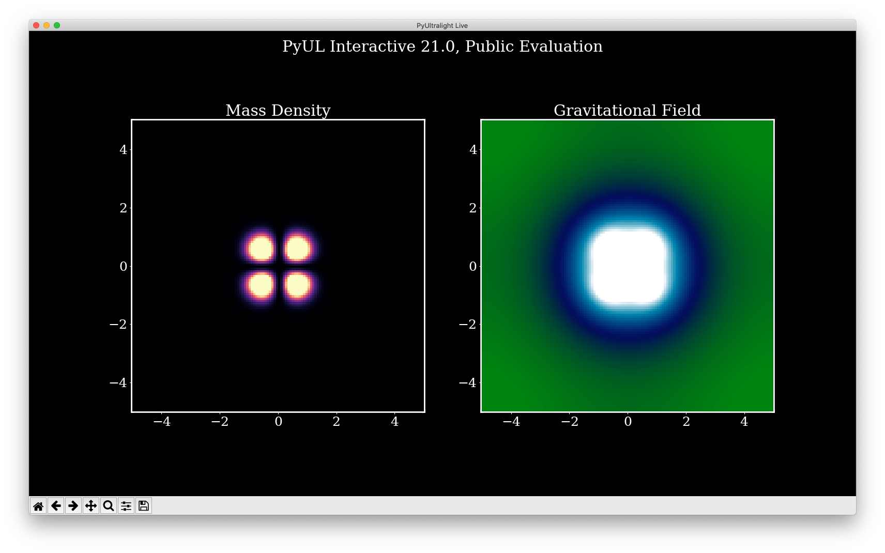

# PyUL Interactive
Quantum Fluid Simulation At Your Fingertip, Enabled by PyUltraLight v2.21.

# Public Release Notes
This version is a toy, and most scientific functionalties are trimmed to save space.

